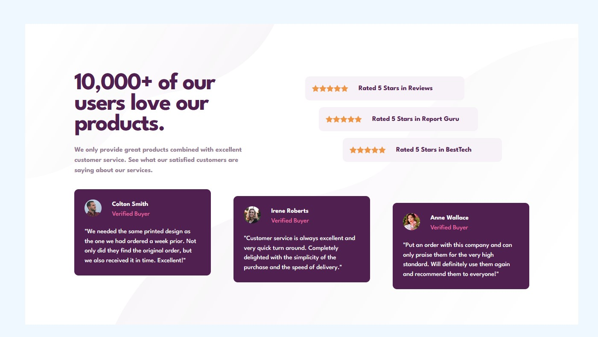

# Frontend Mentor - Social proof section solution

This is a solution to the [Social proof section challenge on Frontend Mentor](https://www.frontendmentor.io/challenges/social-proof-section-6e0qTv_bA). Frontend Mentor challenges help you improve your coding skills by building realistic projects. 

This project tested my abilities to offset items and then make them responsive. Surely theres a better way to do some of my styling.

### Screenshot

### Links

- Solution URL: [Social Proof](https://palmettophoto/social-proof-section1.git)
- Live Site URL: [View live solution](https://palmettophoto.github.io/social-proof-section1/)

## My process

### Built with

- Semantic HTML5 markup
- CSS custom properties
- Flexbox

### What I learned
Definitely need to work on offset placement and adapting to responsive.
### Continued development
Continued practice with css and jumping back into javascript

## Author

- Website - [Rock Hill Video Marketing](https://rockhillvideomarketing.com)
- Frontend Mentor - [@Taddo](https://www.frontendmentor.io/profile/taddo)

